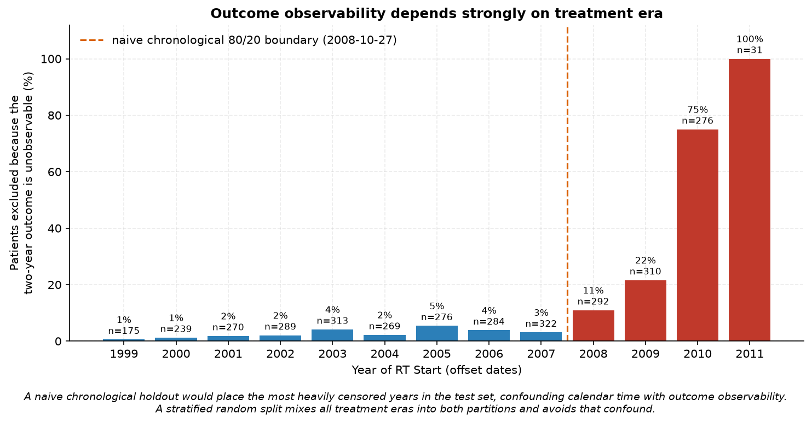
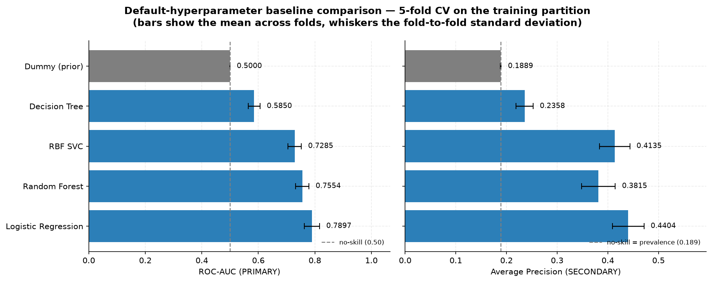
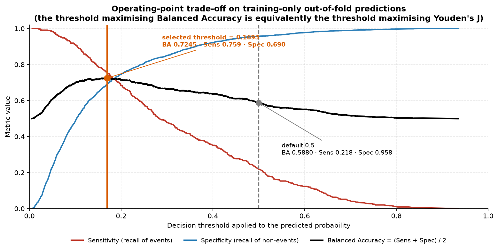
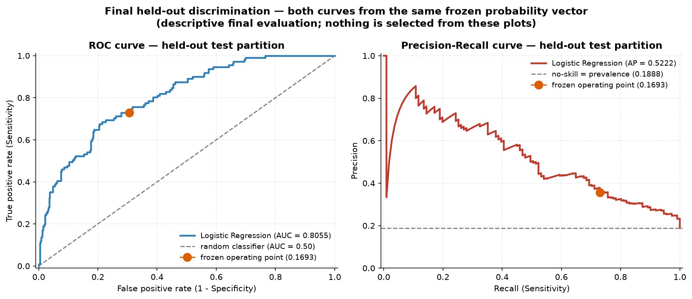
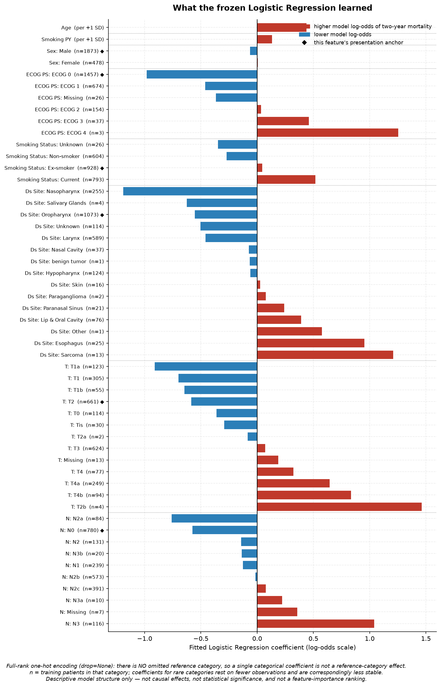

# RADCURE ML — Two-Year Mortality Prediction in Head and Neck Tumours

Applied machine learning project on the RADCURE Clinical Dataset.

> **Research question.** How reliably can two-year all-cause mortality following
> the start of radiotherapy be predicted in patients with head and neck tumours,
> using clinical, demographic and tumour-related characteristics available before
> treatment initiation and classical machine learning methods?

**Result.** A logistic regression on eight pre-treatment clinical variables
reaches **ROC-AUC 0.8055** on a held-out test partition it never influenced.
Four structurally different model families — linear, kernel, stacked ensemble
and gradient boosting — land within 0.012 ROC-AUC of each other, which points to
the available features, rather than the choice of model, being the binding
constraint.

---

## Continuation of a separate EDA project

This repository is the **methodological continuation of a separate exploratory
data analysis project**:

**→ [github.com/cabait00/radcure-eda](https://github.com/cabait00/radcure-eda)**

That project examined the RADCURE clinical data in depth — data quality,
missingness, outliers, univariate distributions, bivariate relationships,
cross-variable consistency and plausibility checks. Its findings are what this
repository builds on, and they shaped concrete decisions here:

- **Deterministic cleaning.** Which values are spelling or case variants of one
  another, and which codes (`TX`, `NX`, `Unknown`, `na`, bound tokens such as
  `>50`) record "not assessable" rather than a measurement.
- **Ambiguous and implausible values.** `ECOG 0-1` and the undocumented
  `T1 (2)`-style codes become missing rather than being assigned a grade that
  was never recorded. A statistical outlier is not treated as a known data
  error: nothing is clipped, winsorised or deleted for being unusual, and
  documented cross-variable inconsistencies stay documented rather than
  silently "corrected".
- **Predictor eligibility.** Cardinality, structural versus incidental
  missingness, and redundancy between variables — the reasons `Subsite`,
  `Stage`, `Path`, `M` and `HPV` are not in the primary predictor set.
- **Leakage prevention.** Which columns are recorded during or because of
  follow-up, and which are proxies for treatment era or dataset membership.
- **Missing information.** Missingness is represented, never imputed away, for
  the categorical predictors; numeric imputation happens inside the modelling
  pipeline, fitted on training folds only.

The full EDA is **not** repeated here. This repository re-runs only the compact
checks the modelling decisions depend on.

---

## Study design

|  |  |
| --- | --- |
| **Prediction landmark** | immediately before the first radiotherapy fraction, operationalised by the observed `RT Start` date |
| **Target** | death within ≤ 730 days of `RT Start` (event) vs. death later or alive with ≥ 730 days of documented follow-up (non-event) |
| **Excluded** | alive with < 730 days of follow-up — the two-year outcome is not observable, and these patients are never assigned to class 0 |
| **Task** | fixed-horizon binary classification; time-to-event modelling is outside the scope of this project |
| **Cohort** | 3346 raw → **2939 eligible** (555 events, 2384 non-events, 18.9% prevalence); 407 excluded for insufficient follow-up |
| **Split** | stratified random 80/20, `random_state=42` → 2351 train (444 events) / 588 test (111 events) |
| **Cross-validation** | `StratifiedKFold(n_splits=5, shuffle=True, random_state=42)`, training partition only |

**Predictors (8, frozen before any model was fitted):** `Age`, `Sex`,
`ECOG PS`, `Smoking PY`, `Smoking Status`, `Ds Site`, `T`, `N`.

Selected on temporal availability, leakage prevention, information content,
redundancy, data structure and clinical plausibility — **not** by screening
variables on outcome performance:
34 raw columns → 21 excluded by the leakage and temporality audit → 13
candidate predictors retained for predictor-design review → 5 further
predictor-design exclusions (`M`, `Stage`, `Subsite`, `Path`, `HPV`)
→ 8 primary predictors.

### Why two years

One year was considered relatively short for the intended prediction problem.
Horizons substantially beyond two years materially reduce outcome observability
in this dataset and increase exclusions for insufficient follow-up. Two years is
a practical compromise **in this dataset** between a meaningful prediction
horizon and adequate outcome observability — not a universal or clinically
optimal mortality horizon.

### Why not a temporal holdout



Exclusion for insufficient 730-day follow-up runs at 1–5% through 2007, then
rises to 11%, 22%, 75% and 100% in 2008–2011. A naive chronological holdout
would put the most heavily censored years in the test set, confounding calendar
time with outcome observability. A stratified random split mixes all treatment
eras into both partitions and avoids that confound.

---

## The pipeline

Seven chronological scripts, each consuming the artefacts of its predecessors.
The split is created **once**, in `analysis/01`; nothing downstream splits again.

| script | does | produces |
| --- | --- | --- |
| `analysis/01_project_foundation.py` | cleaning, target construction, leakage audit, predictor set, the one train/test split | `data/processed/modeling_cohort.csv` |
| `analysis/02_baseline_modeling.py` | five default-hyperparameter families under fixed CV; shortlist | `artifacts/02_*` |
| `analysis/03_hyperparameter_tuning.py` | one controlled `GridSearchCV` per shortlisted family | `artifacts/03_*` |
| `analysis/04_model_complementarity_and_exploratory_models.py` | out-of-fold complementarity, stacking, exploratory XGBoost, **final model choice** | `artifacts/04_*` |
| `analysis/05_threshold_selection_and_model_freeze.py` | training-only threshold selection; fits and freezes the final model | `artifacts/05_*`, `models/*.joblib` |
| `analysis/06_final_heldout_test_evaluation.py` | the held-out evaluation stage | `artifacts/06_*` |
| `analysis/07_final_model_interpretation.py` | descriptive coefficient interpretation | `artifacts/07_*` |

Reusable implementation lives in `src/radcure/`; scientific reasoning lives in
`analysis/`. See [`artifacts/README.md`](artifacts/README.md) for what each
artefact contains.

### Running it

Tested with Python 3.13.15 and the pinned versions in
[`requirements.txt`](requirements.txt).

```bash
python -m pip install -r requirements.txt

for f in analysis/0*.py; do python "$f"; done   # 01 -> 07, in order
python -m pytest -q                             # scientific + structural invariants
```

A fresh clone already contains the immutable RADCURE Version 4 clinical
workbook (`data/raw/`), the frozen generated modelling cohort
(`data/processed/`), and the tracked aggregate scientific artifacts and
figures — see [`data/README.md`](data/README.md) for the source data's
license and attribution. Running `analysis/01` rebuilds the processed cohort
from the source workbook and reproduces it byte-for-byte.

The scripts are VS Code / Jupyter compatible (`# %%` cells) and also run
headless. `analysis/03` takes roughly 8 minutes and `analysis/04` roughly 15;
the rest are seconds.

---

## Project architecture and reproducibility design

The repository is organised in three layers, and the separation is
intentional rather than incidental.

**`analysis/`** is the chronological scientific narrative: what was done at
each stage, why it was done, and what artefact that stage produces.
**`src/radcure/`** is reusable technical implementation: how each operation
— cleaning a column, building a pipeline, computing a threshold — is
actually carried out. **`tests/`** protects both layers: ordinary software
correctness (does a function do what it claims) and scientific invariants
(does the cohort still have 2939 eligible patients, does the split still
train on exactly the same rows).

**Why seven separate scripts, not one `main.py`.** The scripts preserve the
scientific chronology `01 → 02 → 03 → 04 → 05 → 06 → 07`, and keep each
decision — target construction, split design, model selection, threshold
selection, held-out evaluation, interpretation — individually auditable and
independently re-runnable. Collapsing them into one script would make it
easy to lose track of which decision was made with which information
available at the time, which is exactly the discipline a frozen
model-development cycle depends on.

**A sequential artefact pipeline.** Each script consumes the persisted
outputs of its predecessors rather than rebuilding the scientific workflow
from the raw workbook every time. This is not just an engineering
convenience: it improves reproducibility (every number traces to a specific
file), traceability (the artefact table above shows exactly what each stage
needs and produces), runtime (an eight-minute grid search runs once, not
seven times), and — most importantly — it removes the *opportunity* for a
downstream script to accidentally re-split the cohort or refit a model that
should stay frozen.

**Why the train/test split exists only once.** The frozen split is
generated a single time, in `src/radcure/cohort.py::assign_frozen_split`,
invoked only by `analysis/01`, and persisted at patient level in
`data/processed/modeling_cohort.csv`. Every later stage loads that exact
assignment. Row order is deliberately preserved end to end, because
`StratifiedKFold(shuffle=True, ...)` assigns folds by the *position* of a
sample, not its identity — reloading the same patients in a different order
would silently produce different cross-validation folds and different
numbers.

**Why the persisted cohort is not globally preprocessed.** Before the
split, only operations that estimate no statistical parameter run:
deterministic semantic cleaning, target construction, observability
filtering. After the split — and, during cross-validation, strictly inside
each fold — the *learned* preprocessing runs: median imputation, scaling,
one-hot encoding. The persisted cohort therefore contains semantically
cleaned predictor values but no globally fitted imputation, scaling or
encoding. This is what keeps preprocessing leakage-safe: no statistic
computed from the held-out patients can ever influence a value seen by the
training pipeline.

**Artefact locations.**

| location | holds |
| --- | --- |
| `data/raw/` | the immutable RADCURE Version 4 clinical source workbook (CC BY 4.0, versioned) |
| `data/processed/` | generated frozen modelling cohort and split assignment; intentionally versioned for reproducibility |
| `artifacts/` | small, reproducible aggregate results and configuration files |
| `models/` | the fitted final sklearn pipeline (generated, local) |
| `figures/` | generated scientific visualisations |

**Model persistence.** `analysis/05` fits the final logistic-regression
pipeline on the complete frozen training partition and persists it with
`joblib`. `analysis/06` and `analysis/07` load that same fitted object rather
than fitting new copies, so the held-out evaluation and the coefficient
interpretation both describe the identical fitted model — not two
separately-fitted approximations of it.

**Git policy.** Tracked: source code, tests, documentation, figures, the
aggregate result/configuration files under `artifacts/`, the CC BY 4.0
RADCURE Version 4 clinical source workbook (`data/raw/`), and the frozen
generated modelling cohort (`data/processed/`) — see
[`data/README.md`](data/README.md) for the source data's license and
provenance. Not tracked: patient-level out-of-fold and held-out prediction
tables (`artifacts/04_oof_scores.csv`, `artifacts/06_heldout_predictions.csv`),
the fitted model binary, and caches / local development and reference
material — all regenerable by re-running the pipeline.

---

## Model development

All model development used the training partition only. The held-out partition
is loaded only in `analysis/06`, for the dedicated held-out evaluation stage.

### Baseline comparison



### Tuned results

| model | ROC-AUC | Avg. Precision | Balanced Accuracy | status |
| --- | --- | --- | --- | --- |
| Logistic Regression | 0.7897 ± 0.0270 | 0.4404 | 0.5879 | prespecified |
| Random Forest | 0.7791 ± 0.0254 | 0.4374 | 0.5270 | prespecified |
| RBF SVC | 0.7909 ± 0.0194 | 0.4421 | 0.7090 | prespecified |
| Stacking (LR+RF+SVC) | 0.7905 ± 0.0194 | 0.4424 | 0.5756 | exploratory |
| XGBoost (refined) | 0.7885 ± 0.0178 | 0.4375 | 0.5835 | exploratory |

**Reading the SVC's Balanced Accuracy correctly.** The tuned SVC's Balanced
Accuracy (0.7090) is far above the others', and it would be easy to misread that
as better discrimination. It is not. On the two threshold-independent metrics
the SVC and the logistic regression are essentially tied (ROC-AUC 0.7909 vs.
0.7897; AP 0.4421 vs. 0.4404). Balanced Accuracy is threshold-dependent, and the
tuned SVC's `class_weight="balanced"` moves where its native decision rule
falls — its in-sample positive-prediction rate under that native rule is 0.363
against the logistic regression's 0.077, both at the conventional 0.5 cut. The
comparison is between two different
operating points, not two levels of discrimination. Choosing an operating point
for the logistic regression later raises its Balanced Accuracy from 0.588 to
0.725 without changing its ROC-AUC or AP at all.

### A performance plateau

Cross-validated discrimination is very similar across a linear model, a kernel
method, a three-model stack and gradient-boosted trees. The total spread across
all candidates (**0.0118 ROC-AUC**) is smaller than a single model's
fold-to-fold standard deviation (0.0270). Their out-of-fold scores are also
highly correlated — Spearman 0.99 between the logistic regression and the SVC.

This suggests an **empirical performance plateau for this predictor set and
evaluation design**: additional model complexity appears to provide limited
incremental value, which points to the predictive information available in these
eight baseline features being a stronger bottleneck than the choice of model
family. It is an observation about this dataset — not a theoretical maximum, not
a claim that no better model exists, and not proof of an absolute ceiling. A
richer feature set could well move it.

### Why logistic regression, and when that was decided

Logistic regression was selected in `analysis/04`, on threshold-independent
discrimination, and **before any threshold was considered**: essentially
equivalent discrimination, plus simplicity, interpretability, parsimony, and no
extra post-hoc adaptation (it was searched once, while the SVC and XGBoost each
received two search stages).

It did **not** have the numerically highest ROC-AUC. And the operating-point work
in `analysis/05` is not evidence for the choice: that threshold optimises an
already-selected model, it was not a threshold-optimised competition among
finalists, and the Balanced Accuracy it achieves must not be quoted
retrospectively as the reason logistic regression was preferred.

---

## Final model

```
LogisticRegression(C=1.0, class_weight=None, max_iter=5000, random_state=42)
threshold = 0.16929818782414302
```

The threshold was selected on **training-only out-of-fold predictions** by
maximising Balanced Accuracy. Since `BA = (1 + (TPR − FPR)) / 2`, that is the
same optimisation as maximising Youden's J. It is a *training-derived operating
point under equal sensitivity/specificity weighting* — **not** a clinically
optimal threshold: no downstream clinical action and no cost ratio between a
missed event and a false alarm was ever specified in this project.



### Held-out results

| metric | value |
| --- | --- |
| ROC-AUC | **0.8055** |
| Average Precision | 0.5222 |
| Sensitivity / Recall | 0.7297 |
| Specificity | 0.6939 |
| Precision | 0.3568 |
| F1 | 0.4793 |
| Balanced Accuracy | 0.7118 |

Confusion matrix: TN = 331, FP = 146, FN = 30, TP = 81.



These results were not used to revise the predictor set, model family,
hyperparameters, preprocessing or threshold — all of which were frozen before
`analysis/06` ran.

### What the model learned



Interpretation is descriptive and predictive, not causal. Because the encoder
uses `drop=None`, **there is no omitted reference category**, so a single
categorical coefficient is not a conventional reference-category effect; the
contrasts in `artifacts/07_coefficients.csv` are descriptive differences against
each feature's most frequent training category. No p-values, no confidence
intervals, no significance claims.

Coefficients for rare categories should be read cautiously — `ECOG 4` rests on
3 training patients, `T2b` on 4. L2 regularisation reduces, but does not
eliminate, that instability.

---

## Limitations

- **Internal evaluation only.** The test partition is a random 20% of the same
  RADCURE cohort — same source, period, sites and measurement process. It
  estimates performance on RADCURE patients the model did not train on, not on
  an independent population, institution or time period.
- **Observational, not causal.** No causal-inference method was used and none of
  the coefficients supports a causal reading.
- **Eight baseline variables.** The plateau above suggests the ceiling here is
  informational. Richer staging detail, imaging, biomarkers or longitudinal data
  are the plausible way past it.
- **Modest precision at the chosen operating point.** At 18.9% prevalence and an
  equal-weighting threshold, precision is 0.357: most flagged patients do not
  experience the event within two years.
- Before any clinical use, external validation and subgroup validation would be
  the relevant next questions. Neither is implemented here.

---

## Repository layout

```
analysis/     the chronological scientific narrative, 01 -> 07
src/radcure/  reusable implementation (cleaning, target, cohort/split,
              leakage audit, preprocessing, modelling, tuning, ensemble,
              evaluation, artefact I/O, plotting)
tests/        scientific and structural invariants
artifacts/    stage results passed between scripts
figures/      generated figures
data/raw/     immutable RADCURE Version 4 clinical source workbook
data/processed/  generated frozen modelling cohort, versioned for reproducibility
models/       the fitted final pipeline (generated)
```

## Data source and licensing

- **Source:** RADCURE Version 4 clinical data, The Cancer Imaging Archive
  (TCIA). Collection DOI:
  [10.7937/J47W-NM11](https://doi.org/10.7937/J47W-NM11).
- The clinical XLSX (`data/raw/`) is included in this repository under
  [CC BY 4.0](https://creativecommons.org/licenses/by/4.0/).
- The frozen derived modelling cohort (`data/processed/`) is also included,
  with its modifications relative to the source workbook documented.
- The RADCURE CT / RTSTRUCT **imaging** data are **not included** in this
  repository and have separate NIH controlled-access requirements.
- Users must comply with the
  [TCIA Data Usage Policy](https://www.cancerimagingarchive.net/data-usage-policies-and-restrictions/).
- Detailed attribution, the full data citation, and provenance are in
  [`data/README.md`](data/README.md).
